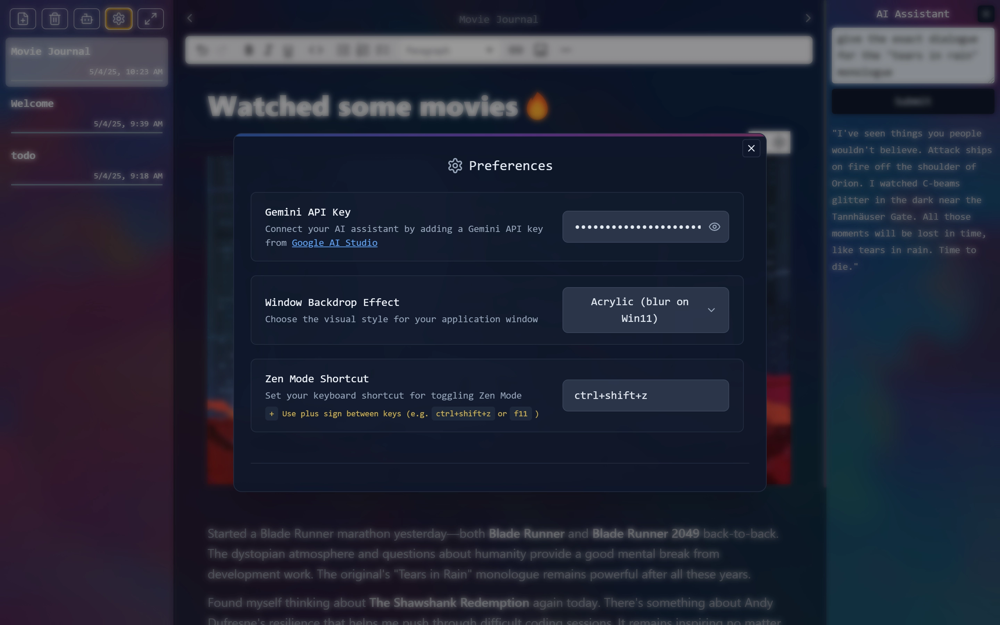

# MarkDoom

**MarkDoom** is an aesthetically pleasing, minimalist desktop journaling application designed for seamless daily writing and note-taking. It combines the simplicity of markdown with modern features to enhance your journaling experience.

## Features

- **Clean, Minimalist Interface** - Focus on your writing without distractions
- **Full Markdown Support** - Express yourself with rich formatting
- **AI-Powered Assistance** - Get journaling prompts and insights powered by Gemini API
- **Works Offline** - Your notes data stays on your device and you can take it anywhere becasue they are simply .md files
- **Cross-Platform** - Available for Windows, Linux, and macOS
- **Free and Open Source** - Use and modify as you need
- **Automatic Saving** - Never lose your thoughts with real-time autosave
- **Modern Blur Effects** - Beautiful transparent UI with backdrop blur effects
- **Multiple Themes** - Choose from different visual styles including Mica, Acrylic and more
- **Zen Mode** - Distraction-free full-screen writing mode with custom shortcuts
- **Material Design** - Beautiful, responsive interface
- **Image Attachments** - Easily add and view images in your notes

## Screenshots

<div align="center">


*Main interface with markdown editor and file navigation*


*Zen Mode for distraction-free writing*


*Image attachments and AI integration*


*Customize your preferences and settings*


*Configure your Gemini API key and toggle various options*


*Beautiful Mica theme for those who hate excessive blur themes*


*Multiple theme options to choose from*

</div>

## Installation

### For Users

Download the latest release binaries for your operating system:

- **Windows**: Download the `.exe` installer from the [releases page](https://github.com/binge-coder/MarkDoom/releases)
- **Linux**: Download the `.AppImage` file from the [releases page](https://github.com/binge-coder/MarkDoom/releases)
- **macOS**: Download the `.dmg` file from the [releases page](https://github.com/binge-coder/MarkDoom/releases)

Alternatively, you can find the binaries in the [`dist`](dist) folder after building the project.

## Development Setup

### Prerequisites

- [Node.js](https://nodejs.org/) (v20.x or later)
- [Bun Package Manager](https://bun.sh/)

### Running in Development Mode

1. Clone the repository:
   ```bash
   git clone https://github.com/binge-coder/MarkDoom.git
   cd MarkDoom
   ```

2. Install dependencies:
   ```bash
   bun install
   ```

3. Start the development server:
   ```bash
   bun dev
   ```

### Building from Source

```bash
# Build for all platforms
bun run build

# Build for specific platforms
bun run build:win    # Windows
bun run build:linux  # Linux
bun run build:mac    # macOS
```

## Technologies Used

- **Frontend**: React.js, TailwindCSS
- **Backend**: Electron.js, Node.js
- **Language**: TypeScript
- **AI Integration**: Gemini API
- **CI/CD**: GitHub Actions

## How It Works

MarkDoom stores your journal entries as Markdown files in the following locations:

- **Windows**: `C:\Users\YourUsername\MarkDoom\`
- **macOS**: `/Users/YourUsername/MarkDoom/`
- **Linux**: `/home/YourUsername/MarkDoom/`

The application provides a rich text editor experience while maintaining the simplicity and portability of plain text files.

## Contributing

Contributions are welcome! Please feel free to submit a Pull Request.

## License

This project is open source and available under the MIT License.

---

Made with ❤️ by [binge-coder](https://github.com/binge-coder)